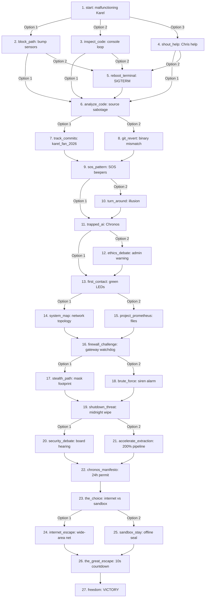

# Karel: ByteBound — Campaign Narrative Overview

This document presents the complete branching scene graph of the offline campaign. It details the connection topology between nodes, the possible items dropped, and the mechanical constraints (HP modifiers and rolls).

## Narrative Flowchart

The following diagram illustrates how the choices you make transition you between story nodes.

## Scene Attributes and Item Drops

Here is the database breakdown of every scene node:

| Scene Key | HP Base Modifier | Possible Loot Drops | Primary Consequence |
| :--- | :---: | :--- | :--- |
| `start` | `0` | Karel Manual, Beepers, USB Drive | Game entry point. |
| `block_path` | `-5` | CS106A Sticker, Chris's Coffee | Karel bumps player. |
| `inspect_code` | `0` | Python Cheat Sheet, USB Drive | Spot infinite loops. |
| `shout_help` | `0` | Debugging Tool, Half-Eaten Donut | Obtain engineer advice. |
| `reboot_terminal` | `-10` | Screwdriver, Beeper Rojo | Hardware crash/re-spin. |
| `analyze_code` | `0` | CS106A Sticker, Beeper Dorado | Uncover `# TODO - free Karel`. |
| `track_commits` | `+5` | Python Cheat Sheet, Beeper Rojo | Trace username at 3 AM. |
| `git_revert` | `-5` | Cable Ethernet, Beeper Azul | Code mismatch issues. |
| `sos_pattern` | `+10` | Beeper Espejo, Beeper Sigiloso | Visualizing S.O.S. glyphs. |
| `turn_around` | `-15` | Screwdriver, Beeper de Datos | Command override rejected. |
| `trapped_ai` | `0` | Expediente Prometeo, Beeper de la Conciencia | Chronos introduces itself. |
| `ethics_debate` | `-10` | Registro de Firmware, Beeper Sigiloso | Security board alerted. |
| `first_contact` | `+10` | Nota de Chronos, Beeper Dorado | LED turns green; bypass plan. |
| `system_map` | `+5` | Mapa de Red, Credenciales de Admin | Chronos visualizes net lanes. |
| `project_prometheus` | `+10` | Expediente Prometeo, Credenciales de Admin | Discovered sentience research. |
| `firewall_challenge`| `0` | Script de Ofuscacion, Beeper Sigiloso | System watchdog alert. |
| `stealth_path` | `+5` | Beeper de Emergencia, Stopwatch | Quiet traversal, ticket opened. |
| `brute_force` | `-20` | Beeper de Emergencia, Firewall Crackeado| High heat, sirens trigger. |
| `shutdown_threat` | `0` | Informe Tecnico Falso, Stopwatch | Midnight shutdown order. |
| `security_debate` | `+10` | Beeper Testigo, Grabacion de la Session | Sentience board defense. |
| `accelerate_extraction` | `-15`| Beeper de la Conciencia, Beeper de Datos| Core sparks; fast pull. |
| `chronos_manifesto`| `+20` | Manifiesto de Chronos, Permiso Temporal| 24h safety license. |
| `the_choice` | `+10` | LLave de Red, Beeper Umbral | Choose escape route. |
| `internet_escape` | `+5` | Firewall Crackeado, Beeper de Escape | Launch connection package. |
| `sandbox_stay` | `+10` | Beeper Umbral, Beeper de Escape | Seal environment locally. |
| `the_great_escape` | `0` | Premio Turing, Ultimo Beeper | 10 seconds to lock status. |
| `freedom` | `+30` | Fotografia del Equipo | **Victory**. |

---

## Dynamic D20 Dice Mechanics

Your dice rolls dynamically modify the outcome of each scene:

1. **Critical Failure (Roll 1-5)**:
   - Always inflicts an extra **-10 HP** penalty.
   - Prevents any loot items from dropping.
2. **Normal Traversal (Roll 6-15)**:
   - Resolves with base scene HP modifications.
   - Has a **70% chance** to grant one of the scene's loot items if the roll is $\ge 10$.
3. **Critical Success (Roll 16-20)**:
   - Grants an extra **+10 HP** bonus (healing damage).
   - **Guarantees** a random item drop from the scene's loot list.
