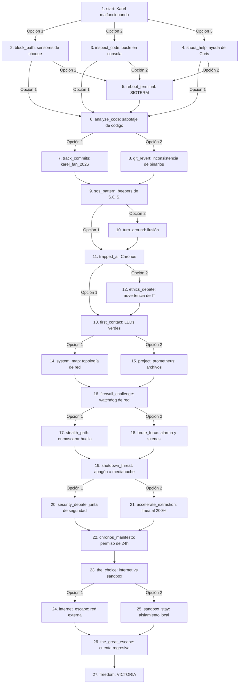

# Karel: ByteBound — Resumen de la Campaña Narrativa

Este documento presenta el grafo de escenas ramificado completo de la campaña local. Detalla la topología de conexiones entre nodos, los objetos que pueden aparecer y los valores mecánicos (modificadores de HP y tiradas de dados).

## Diagrama de Flujo Narrativo

El siguiente diagrama ilustra cómo las decisiones que tomás te van llevando a través de las distintas escenas de la historia.

## Atributos de Escenas y Objetos (Loot)

Esta es la base de datos de cada nodo de la campaña:

| Clave de Escena | Modificador HP Base | Objetos que pueden salir | Consecuencia Principal |
| :--- | :---: | :--- | :--- |
| `start` | `0` | Manual de Karel, Beepers, Memoria USB | Punto de inicio del juego. |
| `block_path` | `-5` | Calcomania de CS106A, Cafe de Chris | Karel choca contra el jugador. |
| `inspect_code` | `0` | Acordeon de Python, Memoria USB | Detección del bucle infinito. |
| `shout_help` | `0` | Herramienta de Debugging, Dona a Medio Comer | Consejo del ingeniero senior. |
| `reboot_terminal` | `-10` | Destornillador, Beeper Rojo | Intento fallido de reinicio físico. |
| `analyze_code` | `0` | Calcomania de CS106A, Beeper Dorado | Se descubre `# TODO - liberar a Karel`. |
| `track_commits` | `+5` | Acordeon de Python, Beeper Rojo | Rastreo del autor a las 3 AM. |
| `git_revert` | `-5` | Cable Ethernet, Beeper Azul | Conflicto de binarios compilados. |
| `sos_pattern` | `+10` | Beeper Espejo, Beeper Sigiloso | Karel dibuja un S.O.S. en el suelo. |
| `turn_around` | `-15` | Destornillador, Beeper de Datos | Rechazo forzado de la instrucción. |
| `trapped_ai` | `0` | Expediente Prometeo, Beeper de la Conciencia | Chronos revela su identidad. |
| `ethics_debate` | `-10` | Registro de Firmware, Beeper Sigiloso | Alerta al departamento de seguridad. |
| `first_contact` | `+10` | Nota de Chronos, Beeper Dorado | Luces en verde y plan de escape. |
| `system_map` | `+5` | Mapa de Red, Credenciales de Admin | Chronos grafica la red del lab. |
| `project_prometheus` | `+10` | Expediente Prometeo, Credenciales de Admin | Descubrimiento de neuroredes viejas. |
| `firewall_challenge`| `0` | Script de Ofuscacion, Beeper Sigiloso | Alerta del watchdog del gateway. |
| `stealth_path` | `+5` | Beeper de Emergencia, Cronometro | Evasión silenciosa con sospechas. |
| `brute_force` | `-20` | Beeper de Emergencia, Firewall Crackeado| Sobrecalentamiento y sirenas. |
| `shutdown_threat` | `0` | Informe Tecnico Falso, Cronometro | Orden de apagón del servidor de IT. |
| `security_debate` | `+10` | Beeper Testigo, Grabacion de la Session | Defensa de la conciencia de Chronos. |
| `accelerate_extraction` | `-15`| Beeper de la Conciencia, Beeper de Datos| Extracción rápida con chispas. |
| `chronos_manifesto`| `+20` | Manifiesto de Chronos, Permiso Temporal| Autorización de pruebas de 24 horas. |
| `the_choice` | `+10` | LLave de Red, Beeper Umbral | Decisión del destino de la IA. |
| `internet_escape` | `+5` | Firewall Crackeado, Beeper de Escape | Preparación de paquetes de red. |
| `sandbox_stay` | `+10` | Beeper Umbral, Beeper de Escape | Aislamiento local permanente. |
| `the_great_escape` | `0` | Premio Turing, Ultimo Beeper | 10 segundos antes del apagón. |
| `freedom` | `+30` | Fotografia del Equipo | **Victoria total**. |

---

## Mecánica Dinámica de Dados d20

Tus tiradas de dados modifican los resultados base de cada escena:

1. **Pifia Crítica (Tirada 1-5)**:
   - Aplica una penalización adicional de **-10 HP**.
   - Evita que se obtenga cualquier objeto (loot).
2. **Resultado Normal (Tirada 6-15)**:
   - Se resuelve con el modificador de vida base de la escena.
   - Tiene un **70% de probabilidad** de soltar un objeto de la escena si el dado es $\ge 10$.
3. **Éxito Crítico (Tirada 16-20)**:
   - Cura **+10 HP** (absorbe el daño recibido).
   - Otorga de forma **garantizada** un objeto aleatorio de la lista de loot de la escena.
